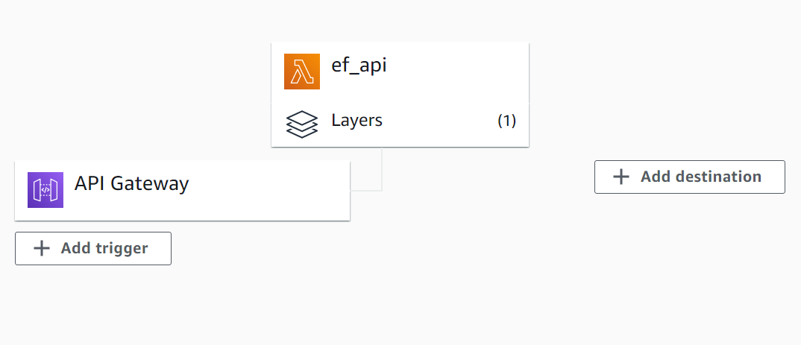

# Portfolio-Optimization
Creating a python program to optimize budget allocation for selected stocks to gain maximum return using efficient frontier method.

Deploying the module as AWS serverless API using AWS lambda and AWS API gateway. It can provide good results for more diversified portfolios or portfolios with many stocks.

# Efficient Frontier
A modern portfolio theory for estimating maximmum expected return for a given risk. Instead of using formula 10000 monte carlo simulation have been caluclated for the given portfolio and the maximum expected return is calculated for a given risk using the simulations.  
     


# Assumptions
1. All investors make decision rationally and have knowledge about all the facts of the markets
2. The portfolio is diversified
3. The assests follow a normal distribution
4. The real costs like taxes, brokerage, fee, etc. are not taken into consideration while constructing the frontier.

# Package Overview

# API-Syntax
```https://gqpev2z6wl.execute-api.ap-south-1.amazonaws.com/getEF?amount=<amount>&stocks=<Stock1>&stocks=<stock2>&stocks=<stockn>```

# API-Example
```https://gqpev2z6wl.execute-api.ap-south-1.amazonaws.com/getEF?amount=10000&stocks=GOOG&stocks=AMZN```

# API-Output
```{"symbols": ["GOOG", "AMZN"], "list": {"1": {"price": [8628.0, 1246.3], "output_stocks": [75.0, 10.0], "remaining": 125.7, "expected return": 0.256, "risk": 0.32}, "2": {"price": [9893.44, 0.0], "output_stocks": [86.0, 0.0], "remaining": 106.56, "expected return": 0.267, "risk": 0.33}}}```

# Challenges Faced
1. Had trouble in using lambda layers for installing dependencies 
    - **Solution** - Used AWS Lambda layers with proper file structure, i.e 
     ```python ->site_lib->packages``` and installed the dependencies in a linux environment using WSL
2. Had trouble in displaying get response in browser
    - **Solution** - Changed key output to body in the return response
3. Had trouble in finding errors in the program
    - **Solution** - Used AWS cloudwatch and print (event) in lambda_function.py
